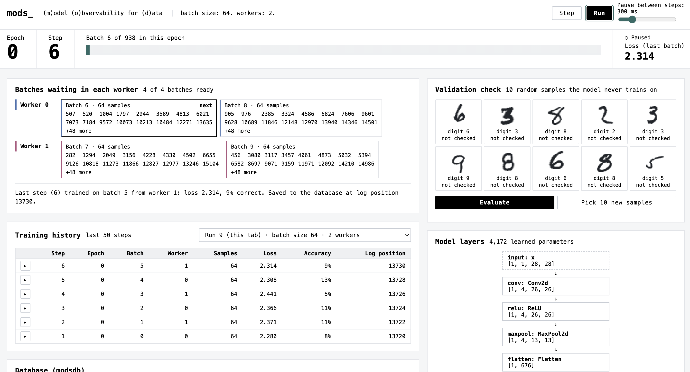

# mods_: (m)odel (o)bservability for (d)ata

mods_ lets you watch a PyTorch model train while every sample it sees is served from **modsdb**,
a small database written in Go. As the DataLoader's workers prefetch batches, they mark those rows
as queued in the database. Each training step then records which samples it used, their
predictions, the loss and the accuracy. The web page shows all of it live, read straight from the
database.



The demo trains a tiny CNN on MNIST: one 3×3 convolution, ReLU, max pooling, then two linear
layers.

## What you can do

- Pick a batch size and number of workers each time you open the page. Opening the page starts
  the one run with a fresh model; the previous run and its history are dropped.
- Step through training one batch at a time, or let it run.
- See which batches each worker has prepared and which one is next.
- Check the model on 10 random validation images, and see how confident it is for each digit.
- Browse the last 50 training steps and expand any step to see its samples.

## How modsdb works

modsdb keeps its tables in memory and makes every change durable before acknowledging it:

- **Write-ahead log:** every change is appended to the log first, and many concurrent writes share
  one disk sync (group commit).
- **Snapshots:** the full state is saved periodically, and older log segments are deleted.
- **Recovery:** after a crash, it loads the latest snapshot and replays the rest of the log.

Each training step is written as one atomic batch, so the history and the data never disagree.

## Run it

You need Python 3.10+ with PyTorch, and Go 1.22+.

```bash
./mods start    # sets everything up on first run, then serves http://127.0.0.1:8000
./mods stop     # also: status, restart, logs, open
```

The first start downloads MNIST (about 11 MB) and loads it into the database, which takes about
20 seconds. Everything stays on your machine.

## Tests

```bash
(cd db && go test ./...)    # log, snapshots, crash recovery, concurrent writers
.venv/bin/python -m pytest  # training, worker queues, the web API
```

## Layout

- `db/`: modsdb (Go). The API is in `db/proto/modsdb/v1/modsdb.proto`.
- `python/mods/`: the Python client, data loading, training session and web app.
- `examples/mnist_cnn.py`: the demo model.
- `mods`: start/stop script.
